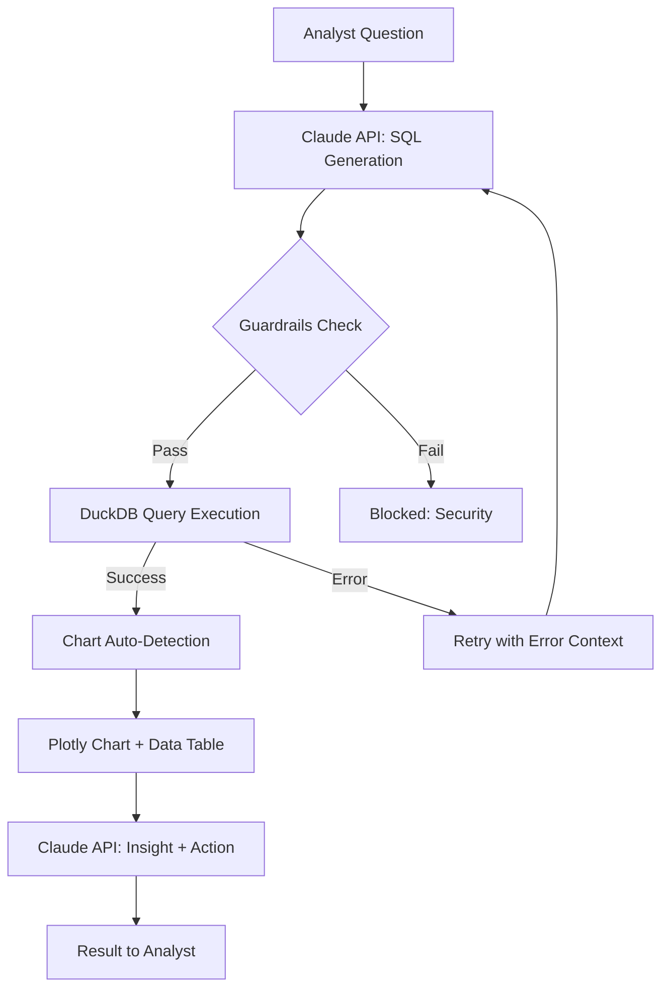
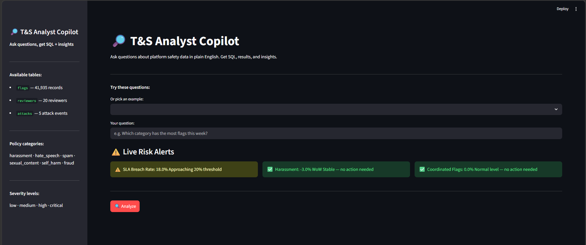
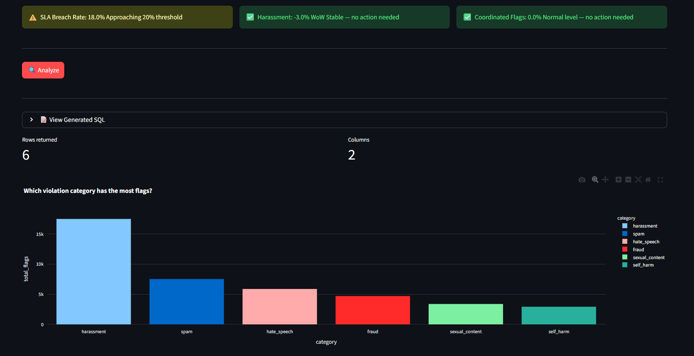
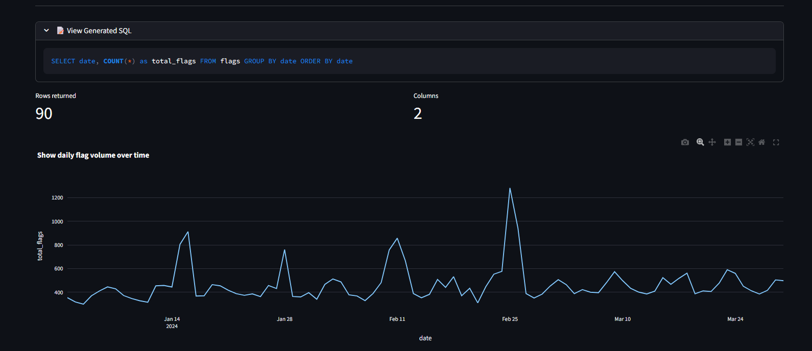
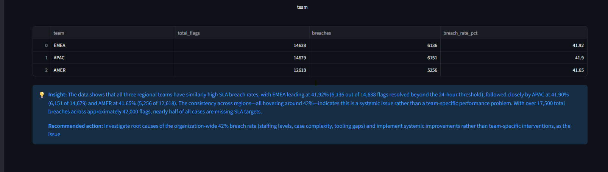

# 🔎 T&S Analyst Copilot

A Trust & Safety specific analyst copilot where analysts ask questions in plain English and get SQL, results, charts, and actionable recommendations back. Built on top of the same 90-day synthetic platform dataset from the T&S Ops Dashboard.

**Built for:** Google T&S / Analytics Engineer roles  
**Stack:** Python · Streamlit · DuckDB · Plotly · Claude API · Pandas

---

## 🎯 Problem

T&S analysts spend hours writing SQL to investigate safety issues. This copilot lets them ask questions in plain English, get instant results with auto generated charts, and receive recommended actions, all without touching SQL.

---


## 🏗️ System Architecture


---

## 📸 Screenshots

### Live Risk Alerts — Always-On Platform Health


### Category Analysis — Bar Chart + Recommended Action


### Time Series — Daily Flag Volume


### Multi-Table JOIN — Team SLA Breach Rate




---

## ⚡ Key Features

### 1. Natural Language to SQL
Type any question about platform safety data. Claude generates DuckDB SQL using exact column names from the schema, no hallucinated columns, no wrong table names.

### 2. Agentic Retry Loop
If SQL fails, Claude receives the error message + original question + failed SQL and fixes it automatically. Up to 2 retries before failing gracefully.

### 3. Guardrails
Every query is checked before execution. Blocks access to system tables, forbidden keywords, and any resource outside the 3 allowed tables (flags, reviewers, attacks).

### 4. Chart Auto-Detection
No asking Claude to pick a chart type — detected automatically:
- Date column present → Line chart
- Category + numeric → Bar chart
- Anything else → Table only

### 5. Live Risk Alerts
Three always-on alerts computed on page load:
- SLA breach rate vs 20% threshold
- Harassment week-over-week trend
- Coordinated attack flag rate

### 6. Insight + Recommended Action
Every query result gets a Claude-generated explanation with a specific recommended action for the T&S team.

---

## 🗄️ Database Schema (DuckDB)

### flags (41,935 rows)
| Column | Type | Description |
|--------|------|-------------|
| flag_id | VARCHAR | Unique flag identifier |
| date | DATE | Flag creation date |
| category | VARCHAR | hate_speech / harassment / spam / sexual_content / self_harm / fraud |
| severity | VARCHAR | low / medium / high / critical |
| action | VARCHAR | allow / downrank / human_review / auto_block |
| reviewer_id | VARCHAR | Assigned reviewer |
| resolution_hrs | DOUBLE | Hours to resolve |
| ml_score | DOUBLE | ML classifier confidence |
| coordinated_flag | BOOLEAN | Part of coordinated attack |
| attack_id | VARCHAR | Attack event ID if coordinated |

### reviewers (20 rows)
| Column | Type | Description |
|--------|------|-------------|
| reviewer_id | VARCHAR | Unique reviewer ID |
| team | VARCHAR | AMER / EMEA / APAC |
| capacity_per_day | BIGINT | Max cases per day |
| seniority | VARCHAR | junior / mid / senior |

### attacks (5 rows)
| Column | Type | Description |
|--------|------|-------------|
| attack_id | VARCHAR | Unique attack ID |
| category | VARCHAR | Policy category targeted |
| num_accounts | BIGINT | Accounts involved |
| pattern | VARCHAR | Attack pattern description |
| severity | VARCHAR | medium / high / critical |

---

## 💡 Example Questions

"Which violation category has the most flags?"
"Show daily flag volume over time"
"What is the SLA breach rate for high and critical cases?"
"Which team (AMER, EMEA, APAC) has the highest SLA breach rate?"
"Show coordinated attack events and how many accounts were involved"
"Which reviewer has the most cases assigned?"
"What percentage of flags were auto-blocked vs sent to human review?"
"Show harassment flags trend over the last 30 days"
"Which attack event had the most accounts involved?"
"What is the auto-block rate for critical severity flags?"

---

## 🛡️ Guardrails

```python
ALLOWED_TABLES = {"flags", "reviewers", "attacks"}
FORBIDDEN_KEYWORDS = ["information_schema", "pg_", "sys.", "sqlite_", "os.", "subprocess"]
```

Only queries referencing the 3 allowed T&S tables pass through. Everything else is blocked before execution.

---

## 🔄 Agentic Retry Logic
Question → Generate SQL → Check Guardrails → Run Query
↓ (if error)
Retry with error context
↓ (max 2 retries)
Fail gracefully with message

---

## 🛠️ Setup

```bash
git clone https://github.com/yourusername/ts-analyst-copilot
cd ts-analyst-copilot
pip install -r requirements.txt
```

Add your Anthropic API key to `.env`:
ANTHROPIC_API_KEY=sk-ant-...

Copy data files from ts-ops-dashboard:
```bash
cp ../ts-ops-dashboard/data/*.csv data/
```

Launch:
```bash
streamlit run app.py
```

---

## 📁 Project Structure

## 📁 Project Structure

```text
ts-analyst-copilot/
├── data/
│   ├── flags.csv        # 41,935 flag records
│   ├── reviewers.csv    # 20 reviewers
│   └── attacks.csv      # 5 attack events
├── assets/              # Screenshots
├── database.py          # DuckDB connection + schema + query runner
├── app.py               # Streamlit app + Claude integration
├── .env                 # API key (never committed)
├── .gitignore
├── requirements.txt
└── README.md
```

---

## 🎓 Related Projects

- **Project 1:** [AI Content Safety Classifier](https://github.com/ankitasaha34/content-safety-classifier) — ML + Claude API for content moderation
- **Project 2:** [T&S Ops Dashboard](https://github.com/ankitasaha34/ts-ops-dashboard) — Platform safety monitoring dashboard

